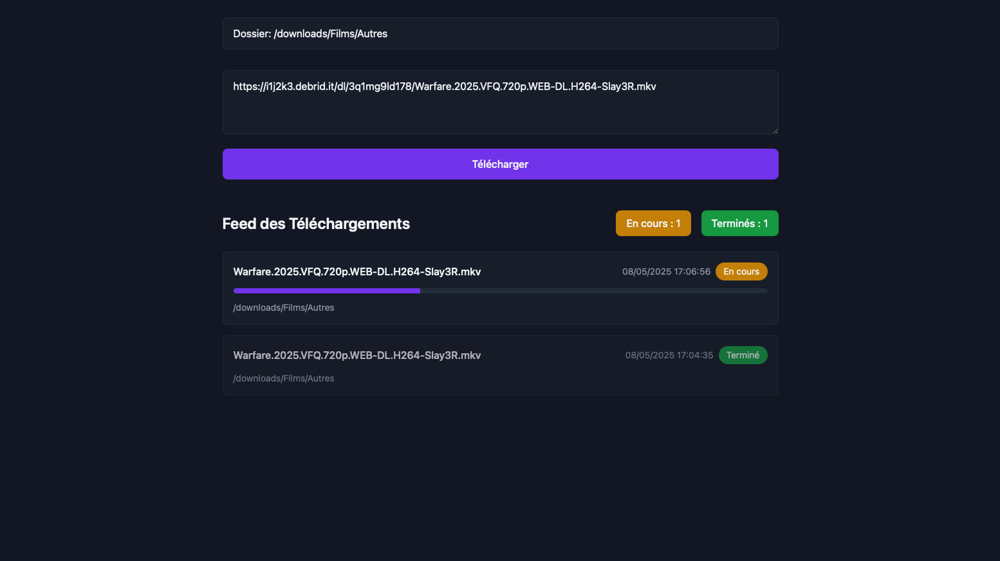

# Web Wget Downloader

**Web Wget Downloader** est une interface web moderne et sécurisée pour télécharger des fichiers via `wget` sur un serveur distant. Elle permet de gérer les téléchargements, de choisir le dossier de destination, de suivre la progression en temps réel et de garder un historique des derniers téléchargements ainsi que des logs via discord webhook.

## Fonctionnalités principales

- Authentification par mot de passe
- Sélection du dossier de destination via une arborescence
- Téléchargement de fichiers par URL (un ou plusieurs à la fois)
- Suivi en temps réel de la progression des téléchargements (WebSocket/Socket.IO)
- Historique des 15 derniers téléchargements terminés
- Notifications en temps réel (et option webhook Discord)
- Interface responsive et moderne (TailwindCSS)
- Protection contre les téléchargements en double
- Configuration des secrets et mots de passe uniquement via variables d'environnement (jamais dans le code)

---

## Prérequis

- Docker (recommandé) ou Python 3.9+
- wget installé sur le serveur

---




---

## Installation & Déploiement

### 1. Cloner le dépôt

```bash
git clone https://github.com/votre-utilisateur/web-wget-downloader.git
cd web-wget-downloader
```

### 2. Configuration des variables d'environnement

Toutes les informations sensibles doivent être passées en variables d'environnement (jamais dans le code !).

Variables nécessaires :
- `APP_PASSWORD` : Mot de passe pour accéder à l'interface
- `FLASK_SECRET_KEY` : Clé secrète Flask (générer une chaîne aléatoire)
- `DISCORD_WEBHOOK_URL` : (optionnel) URL du webhook Discord pour notifications

### 3. Déploiement avec Docker

```bash
docker build -t web-wget-downloader .
docker run -d \
  -e APP_PASSWORD="votre_mot_de_passe" \
  -e FLASK_SECRET_KEY="une_clé_secrète" \
  -e DISCORD_WEBHOOK_URL="https://discord.com/api/webhooks/..." \
  -v /chemin/vers/telechargements:/downloads \
  -p 8080:80 \
  web-wget-downloader
```
